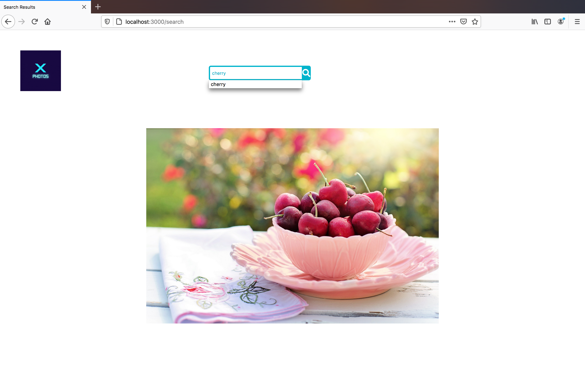
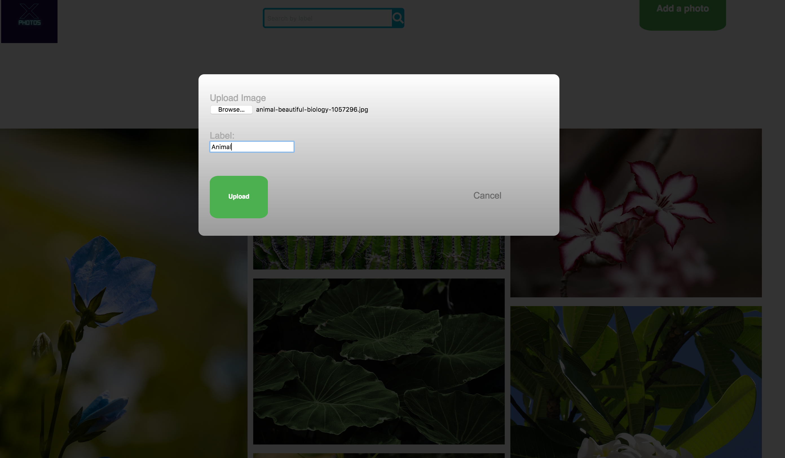

# ExpressPhotoUpload
Photo Upload and Search application built using Express JS,Redis Cache ,Multer API. Multer is a middleware for Express and Node.js that makes it easy to handle multipart/form-data when users upload files.Masonry.js and jquery is used to display the uploaded image files in masonry-grid format.

## Installation
<ul>
  <li>Node and Express.js needs to be installed.</li>
  <li>Multer middleware for file uploading needs to be installed via npm.</li>
  <li>The fs (File System) module provides a lot of very useful functionality to access and interact with the file system.</li>
  <li>There is no need to install it. Being part of the Node.js core, it can be used by simply requiring it: const fs = require('fs')</li>
  <li>Redis is used for searching image files by their labels.</li>
  <li>Redis needs to be installed in the machine and also installed via npm in the application. Connection to redis is set up by using redis.createClient() function       in server.js.</li>


## Usage
Starting Redis Server 
```bash
$redis-server
```

<ul>
<li>Navigate to the application path: cd photoapp</li>
<li>Run the command: node server.js</li>
<li>Open localhost:3000 and view the application running.</li>


## Screenshots


<div align="center">
        
 
        </img>
        
        </img>
        
        </img>
</div>
